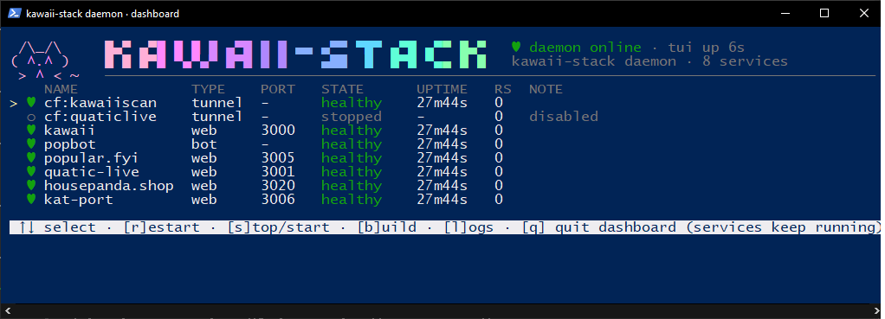

# kawaii-stack

Supervisor daemon + live TUI dashboard for everything this box hosts:
the Cloudflare tunnel(s), kawaii (Next.js standalone, :3000), popbot
(Discord bot), popular.fyi (:3005), quatic-live (:3001), kat-port (:3006).

Replaces the old routine of hand-starting each one in its own PowerShell
window after every reboot (`Desktop\txt\kawaiiscan-setup.txt`).



> The code expects to live at `C:\kawaii-stack` (the scheduled task, `bin\stack.cmd`
> and the installer all use that path). Clone it there:
> `git clone git@github.com:johhncastro/kawaii-stack.git C:\kawaii-stack`

## Commands

| command | what |
|---|---|
| `stack` | live dashboard (TUI). **Quitting it never stops the services.** |
| `stack status` | one-shot status table |
| `stack start\|stop\|restart <svc>` | control one service (ids: `cf-kawaiiscan`, `cf-quaticlive`, `kawaii`, `popbot`, `popular-fyi`, `quatic-live`, `kat-port`) |
| `stack build <svc>` | force rebuild kawaii or popbot (restarts it if running) |
| `stack logs <svc> [-f]` | last 200 log lines, `-f` to follow |
| `stack shutdown` | stop ALL services and exit the daemon (the clean way) |
| `stack daemon` | run the supervisor in the foreground (what the scheduled task runs) |

## Branding

`src/banner.js` owns the look: the block-letter logo with the pink → mint
gradient (`stack help`, and the daemon's console when run in the foreground),
the compact two-row logo in the dashboard header, the animated ASCII cat mascot
(pure ASCII on purpose: fancy glyphs render as `?` in some console fonts), and the
console window title `kawaii-stack daemon`. Art is skipped automatically when
output is piped; set `NO_COLOR=1` to force plain text or `FORCE_COLOR=1` to
force colour. The dashboard drops to a one-line header when the terminal is
too short or narrower than ~75 columns.

## Dashboard keys

`↑/↓` select · `r` restart · `s` stop/start · `b` build · `l` logs · `q` quit dashboard (services keep running)

## How it works

- A single daemon (`src/daemon.js`) spawns every service as a direct child
  (real binaries, not `npm start`), probes web apps over HTTP every 10s,
  restarts crashes with exponential backoff (1s → 60s, gives up after 8 in a
  row until you press `r`), and rotates per-service logs in `logs\` (5MB × 3).
- kawaii and popbot are **rebuilt only when stale** (sources newer than the
  last build). A failed build never touches the running old build.
- The TUI talks to the daemon over the named pipe `\\.\pipe\kawaii-stack`;
  the pipe doubles as the single-instance lock.
- The scheduled task **KawaiiStack** starts the daemon at boot.

## Rules learned the hard way

- **Never** run `C:\kawaii\kawaii\start-production.ps1` — it kills every
  node process on the machine. The daemon only ever kills its own tracked
  PIDs (`taskkill /pid <pid> /t /f`).
- **Never** end the KawaiiStack task from Task Scheduler — that kills all
  services with it. Use `stack shutdown`.
- The old `Cloudflared` Windows service is disabled on purpose (it had no
  config and would double-connect the tunnel). The daemon owns cloudflared.
- `cf-quaticlive` (smp.quatic.live → Minecraft :25565) is disabled by
  default; start it from the dashboard when the Minecraft server is up.

## Configuration

`services.json` describes what runs on this machine and is **not** committed
(it is gitignored - it holds local paths, ports and tunnel config names).
Start from the template:

```powershell
Copy-Item C:\kawaii-stack\services.example.json C:\kawaii-stack\services.json
```

Each entry has an `id` (used by `stack start|stop|logs <id>`), a display
`name`, a `type` (`tunnel` | `web` | `bot`), `cwd`/`command`/`args`/`env` for the
child process, and a `health` block: `"mode": "http"` probes `port` every
`intervalMs`; `"mode": "process"` just watches the PID (optionally waiting for
`readyPattern` in its output). Web apps and bots can carry a `build` block
(`next-standalone` or `tsc`) so `stack build <id>` and stale-source detection
know how to rebuild them. Set `"enabled": false` to keep a service defined but
not auto-started. The installer creates `services.json` from the example if it
is missing and asks you to edit it first.

## Install / uninstall

```powershell
# admin PowerShell
powershell -ExecutionPolicy Bypass -File C:\kawaii-stack\install.ps1
powershell -ExecutionPolicy Bypass -File C:\kawaii-stack\uninstall.ps1
```
